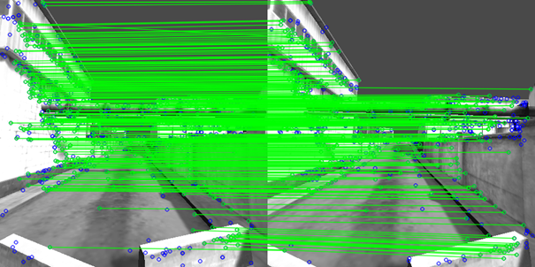
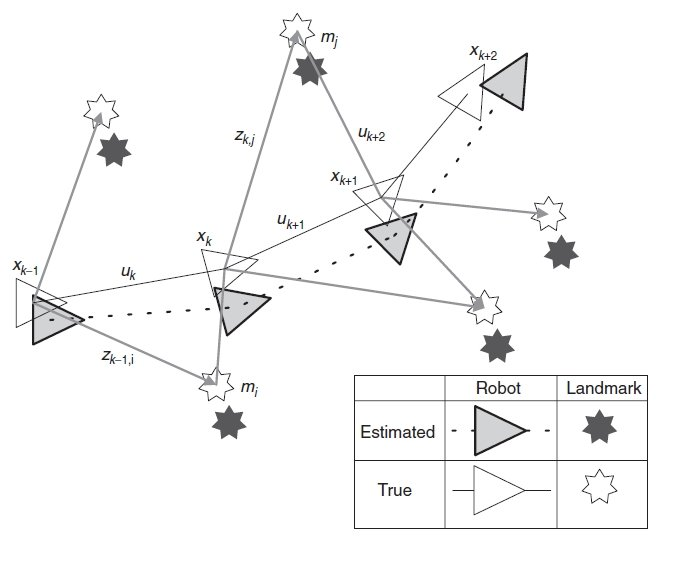
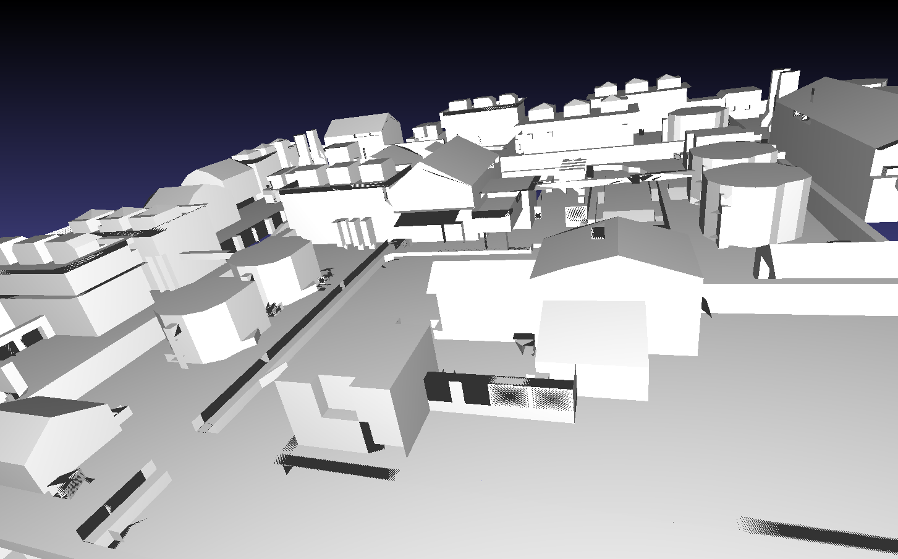

<!--
author:   Jonas Fleischer

email:    jonas.fleischer@student.tu-freiberg.de

version:  0.0.1

language: en

narrator: US English Female

comment: presentation for Seminar Robotik SoSe 2024, "Feature based pose estimation in dark environments" 

link:     https://cdn.jsdelivr.net/chartist.js/latest/chartist.min.css

script:   https://cdn.jsdelivr.net/chartist.js/latest/chartist.min.js


script:   https://cdn.jsdelivr.net/npm/mermaid@10.5.0/dist/mermaid.min.js

logo: assets/logo.png
icon: assets/logo.png


@onload
mermaid.initialize({ startOnLoad: false });
@end

@mermaid: @mermaid_(@uid,```@0```)

@mermaid_
<script run-once="true" modify="false" style="display:block; background: white">
async function draw () {
    const graphDefinition = `@1`;
    const { svg } = await mermaid.render('graphDiv_@0', graphDefinition);
    send.lia("HTML: "+svg);
    send.lia("LIA: stop")
};

draw()
"LIA: wait"
</script>
@end

@mermaid_eval: @mermaid_eval_(@uid)

@mermaid_eval_
<script>
async function draw () {
    const graphDefinition = `@input`;
    const { svg } = await mermaid.render('graphDiv_@0', graphDefinition);
    console.html(svg);
    send.lia("LIA: stop")
};

draw()
"LIA: wait"
</script>
@end

-->

# Comparison of Feature based pose estimation and localization methods in dark environments

[](https://liascript.github.io/course/?https://github.com/halbersacknuesse/seminar_sose_2024/blob/master/presentation.md)

<section>
!?[SLAM_loop](assets/videoplayback.mp4 "Example for SLAM[^vid_00]")<!--
autoplay="true"
muted="true"
loop="true"
-->
[^vid_00]: cygot lab. "2D / 3D Dual SLAM Robot using ROS and LiDAR with Raspberry Pi". YouTube [online] https://www.youtube.com/watch?v=34n1tF5OtQU (05-30-2024)
</section>


## Structure

1. [What is "feature based pose estimation"?](#3)
2. [Wherefore is it used?](#4)
3. [What are known approaches?](#5)
4. [Discussion of the approaches in context of SLAM](#6)
5. [Comparison](#7)

    - Criteria/ Metrics
    - Approaches
    - Conceivable problems for the Comparison

6. [Procedure for the paper](#8)

### What is it about?
- Area in computer vision
- Deals with the prediction and reconstruction of the pose[^*] of an object/ subject in $ \mathbb{R}^3 $.
<section>


</section>

<section>


</section>

[^*]: describes the position and orientation of an object in space.
[^1]: Fleischer et al. "Matching von Features in zwei aufeinander folgenden Bildern mit FLANN-Alg.".
[^2]: H. Durrant-Whyte und T. Bailey. "Simultaneous Localization and Mapping(SLAM): Part I". In IEEE Robotics & Automation Magazine 13.2 (2006), S. 99 110. doi: 10. 1109/MRA.2006.1638022.

### Importance
- can be used:

  - to determine the **position(s)** of **object(s)** in space
  - to determine your **own position** in space
  - for sorting processes and haptic interaction with objects
  - for **SLAM** in conjunction with autonomous vehicles/ robots
  - for orientation and navigation in areas where navigation with GNSS alone is not sufficient (-> accuracy, availability)

- Possibility to fuse sensors and methodologies

> => **Environment Detection and Awarness**


### Approaches
<div style="border: 2px solid black;">
  <h3><center>Process Chain</center></h3>
  <script style="display: block; background: white; width: 100%;" run-once="true" modify="false">
  
  const graphDefinition = `graph LR
    A[1. Data Capture] --> B[2. Pre-Processing]
    B --> C[3. Feature Extraction]
    C --> D[4. Model Creation]
    D --> E[5. Pose Estimation]
  	E --> F[6. Action]
  	F --> A`;
  
  async function draw () {
      const { svg } = await mermaid.render('graphDiv', graphDefinition);
      send.lia("HTML: "+svg);
      send.lia("LIA: stop")
  };
  
  draw()
  "LIA: wait"
  </script>

</div>


{{1}}
<section>
#### Data Capture

> - via optical sensors:
>
>  - RGB camera(s)
>
> - via depth sensors:
>
>  - LiDAR
>  - RADAR
>  - Structured Light Sensor
>  - Time-of-Flight

</section>


{{2}}
<section>
#### Pre-Processing

> - Filtering
>
>  - Gauss
>  - Kalman
>  - ...
> - Normalization
> - Formatting
> - Flexion algorithm
> - Bearing Angle algorithm

</section>


{{3}}
<section>
#### Feature Extraction

> - Edges
> - Textures
> - Colors
> - further Features

</section>


{{4}}
<section>
#### Model Creation

> - static:
>
>  - SIFT (Scale-Invariant Feature Transform)
>  - PPF (Point Pair Features)
>  - SURF (Speeded Up Robust Features)
>  - ORB (Oriented FAST and Rotated BRIEF)
>  - AKAZE (Accelerated KAZE[^*])
>  - FAST (Feature from Accelerated Segment Test)
>
> [](https://liascript.github.io/course/?https://github.com/halbersacknuesse/seminar_sose_2024/blob/master/algorithms.md)
[^*]: japanese "wind"

</section>


{{5}}
<section>
#### Pose Estimation

> Application of the selected model to the data.

</section>


{{6}}
<section>
#### Action

> - Interaction with recognized object
> - Global orientation/ localization
>
> => Navigation/ movement/ interaction/ drive command/ mapping

</section>


### Discussion

{{1}}
<section>
#### Requirements for SLAM
- Accuracy
- Precessing speed/ Performance
- Reliability/ Robustness

> - essential for autonomous vehicles
>
>  - context: relying exclusively on information from ~ (-> GNSS too inaccurate)

> - Accuracy must be high enough to rule out incorrect navigation 
>
>  - e.g. running into an object

> - Reliability/ Robustness must be so high that SLAM can be used even under unfavorable conditions.
>
>  e.g:
>
>  - Fog, snow, rain
>  - Darkness
>  - Failure/ non-existence of other positioning options
>  - Sudden/ temporary changes in the environmental situation (obstacles, vulnerable objects)
>  - Absence of features (e.g. textures, objects, edges, ...)

> - Processing speed must be high enough to handle sudden/temporary changes in the environmental situation (-> real-time capability) 
>
>  - Hardware and implementation must be set up accordingly

</section>


{{2}}
<section>
#### Ideal Scenario
Sensor and Model **Fusion**

- Redundancy
- Complementarity

> - Increases the **complexity** of the system, as interdependencies can arise (depending on the model/ approach)
> - Possibly increases resource requirements

</section>

{{3}}
<section>
#### AI Approaches

- not in scope

</section>


{{4}}
<section>
#### 2D RGB

- no depth information in images 

> -> would have to be modeled

- Features are limited to edges, textures and colors 

> -> differentiation through color changes in the image
  
- possible further processing possible using machine learning

  - Robustness is not necessarily given due to changes in lighting conditions (-> outdoor)

> - Ideal scenario:
>
>  - Constant lighting conditions
>  - Adequate camera/ resolution
>  - High contrast between objects/ features to be recognized
>
>> => SLAM should be possible here

</section>


<section>
!?[SLAM_loop](assets/KITTI.mp4 "KITTY Dataset 03, edited as videoclip[^vid_01]")<!--
autoplay="true"
muted="true"
loop="true"
-->
[^vid_01]: Andreas Geiger et al. "Vision meets Robotics: The KITTI Dataset". cvlibs.net [online] https://s3.eu-central-1.amazonaws.com/avg-kitti/raw_data/2011_09_26_drive_0001/2011_09_26_drive_0001_extract.zip (05-30-2024), edited by Fleischer
</section>


{{5}}
<section>
#### 3D Depth Images

|Sensor|Robustness|Output|Complexity|Accuracy[^*]|
|-----|-----|-----|-----|-----|
|Radar|high, insensitive to light conditions, weather conditions|Distance + Speed|medium (requires processing)| very high|
|ToF|medium, [^+]can be used in very poor lighting conditions, can provide accurate data even in absolute darkness, possible impairment due to weather conditions|Depth information/ Depth map|medium (requires processing)|high|
|LiDAR|medium - high[^+]|3D-Point cloud|high (requires complex algorithms to process point clouds)|very high (can create highly accurate maps of the environment)|
|Stereo camera|low - medium, [^++]depending on lighting conditions, texture of the scene, can be affected by poor lighting, weather conditions, |Depth information/ Depth map|high requires stereo matching, triangulation|medium - high depending on surrounding, camera specs|
|RGB-D camera|low - medium[^++]|RGB images + Depth information (D)|medium (requires processing of color + depth information)|medium - high depending on specs of depth sensor + camera|
|Structures Light Sensor|low [^++] + surface material|Depth information/ Depth map|high (requires complex algorithms to decode light structures)|high can create very accurate depth maps|

[^*]: Accuracy depends on the sensor

- Further processing should be taken in consideration

  - Possibly valid approach: Calculation of Flexion images

</section>

### Comparison
<section>
#### Criteria/ Metrics


> {{1}} Performance
>
> - Synthetic scenario
> - Use of identical Hardware


> {{2}} Robustness/ Accuracy
>
> - Creation of restrictive condition (fog, darkness, ...)
> - Testing the robustness against this influence
> - If necessary, fall back on other sensors/ switch the sensor system
>   - Analysis of the resulting time/calculation effort
> - Deviation between estimation and absolute position (-> must be known in the scenario)

> {{3}} Simplicity of Implementation
> 
> - Costs of the sensor technology
> - Complexity of the setup
> - Structure of the sensor fusion
> - Can the approaches be implemented simply and effectively in a test environment?
> - Are there any special features (specific hardware/ software) to consider?

</section>

<section>
#### Approaches

> - Priority: Approaches with sensor technology that does **not** rely on optical sensors
> - Should not be linked to specific hardware (e.g. NVIDIA)
>   - Use of generic sensors
> - Test scenario: synthetic
>   - High complexity of implementing different approaches in reality
>   - Better comparability
>   - Application of **different approaches/ algorithms** to synthetic scenario

</section>

<section>
#### Potential problems

> - Procurement of different sensors (cost, time)
> - Use of the approaches to be investigated may require adaptation/ self-implementation 
> - Availability of the necessary software/ hardware not necessarily given 
> - Testing only possible with given hardware -> results may be different on other hardware
> - Testing only possible with given software -> the software may not run optimally on the test hardware; the software itself may not be optimized
> - Use of real scenarios could reduce comparability (consistency of test runs not necessarily given)

</section>

### Procedure

<section>
> {{1}} Selection/ creation of a test scenario
> 
> - only synthetic
> - e.g. path in a Blender scene
> - As the focus is on depth data: Textures can be neglected
> - Possible test scenario is already given from a previous work

<section>


</section>

</section>

<section>
> {{2}} Selection of considered algorithms/ approaches
> 
> - Restriction to approaches that can recognize general features in the data
> - Exclusion of approaches that are limited to the recognition of certain objects only 
> - Avoidance of own implementations (time, scope)

</section>

<section>
> {{3}} Application of selected algorithms to the data from the test scenario
> 
> - Restriction to the use of depth data 
> - No use of optical sensors

</section>

<section>
> {{4}} Measurement of processing times for the scenario
> 
> - Real-time calculation possible?

</section>

<section>
> {{5}} Measuring the deviation of the estimation from the absolute position
> 
> - Consideration of several measuring points within the scenario -> thus determination of the accumulation of errors

</section>

<section>
> {{6}} Extension of the comparison by pre-processing the depth data
> 
> - Flexion images
> - Bearing-Angel images

</section>

## Questions & Suggestions

> Questions?

> Suggestions?
>
> - Procedure
>
> - Content

<!--

EOF

-->
